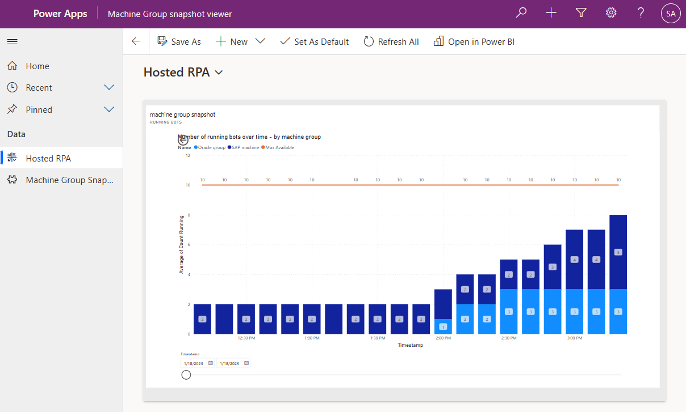

# Power Automate RPA Machine Group Snapshots

A quick Power Platform solution to take snapshots of your Hosted RPA bots utilization.
Read more about [hosted RPA bots in Power Automate](https://learn.microsoft.com/en-us/power-automate/desktop-flows/hosted-machine-groups)

Contains a table to store snapshots, one flow to create them and one to erase after 28 days, and a Power BI report to show data collected.

Solution screenshot:

Known limitations: 
* the max bot capacity (10 in the picture above) is hard-coded in Power BI visual
